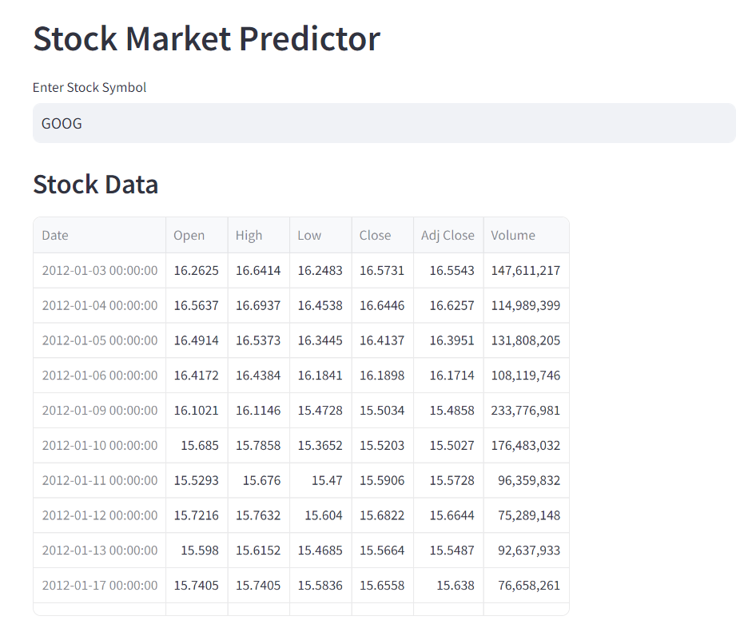
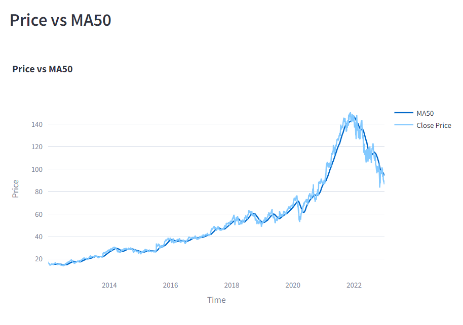
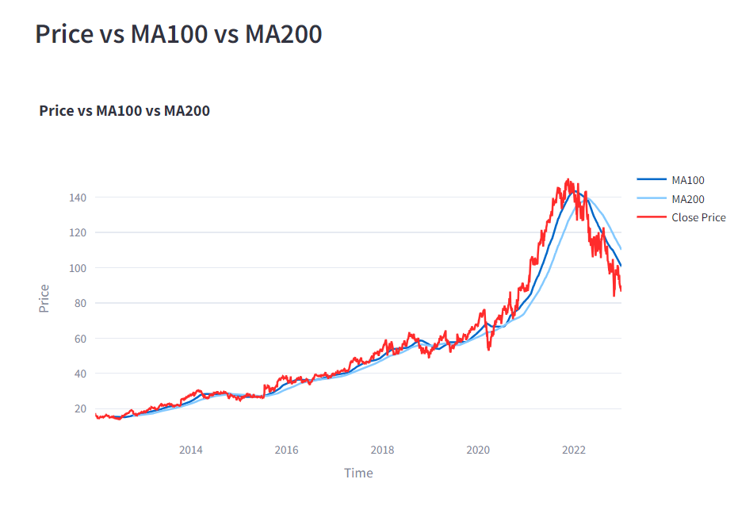
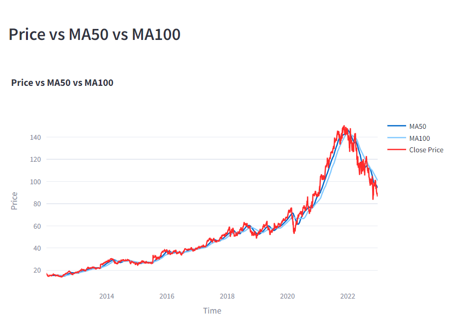
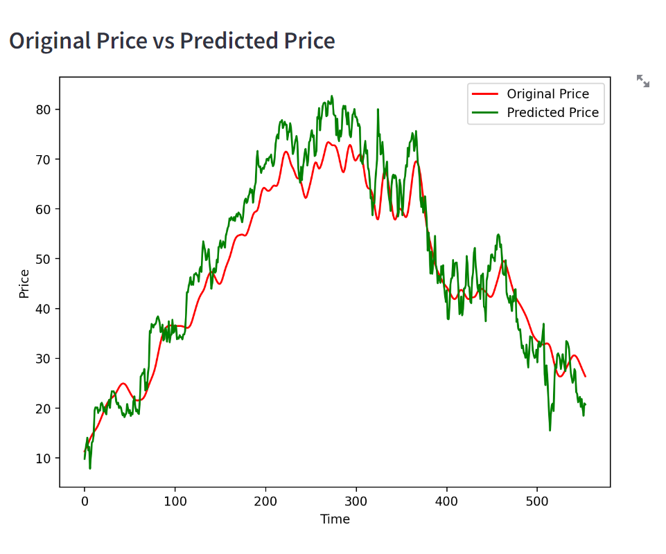

# Stock Price Prediction App

This is a web application for stock price prediction built with Python, Flask, and Streamlit. The application utilizes machine learning algorithms to predict future stock prices based on historical data.
*Main interface of our app*
 <!-- Replace 'images/app_screenshot.png' with your application screenshot -->

## Features

- **Stock Price Prediction**: Users can input the ticker symbol of a stock and view predicted future prices.
- **Interactive Interface**: The application provides a user-friendly interface for inputting stock symbols and displaying predictions.
- **Machine Learning Models**: Various machine learning models are used for prediction, such as linear regression, LSTM, or ARIMA.
- **Historical Data Visualization**: Users can visualize historical stock prices through interactive charts.

## Technologies Used

- **Python**: Programming language used for backend logic and machine learning.
- **Flask**: Web framework used for building the backend RESTful API.
- **Streamlit**: Library used for building interactive web applications with Python.
- **Pandas**: Data manipulation library used for handling stock price data.
- **Scikit-learn**: Machine learning library used for building prediction models.
- **Plotly**: Visualization library used for creating interactive charts.

## Getting Started

### Prerequisites

- Python installed on your machine.
- pip package manager installed.
- Basic understanding of machine learning concepts.

### Installation

1. Clone the repository: origin https://github.com/HarshLambe/stock_price_prediction.git

2. Install dependencies:pip install requirements.txt

### Usage

1. Run the model:python stock_predict.py
   
2. Run the app:streamlit run app.py

3. Open your web browser and go to `http://localhost:8501` to view the app.

4. Enter the ticker symbol of the stock you want to predict.

5. Choose the prediction model (e.g., linear regression, LSTM).

6. Adjust any parameters if necessary.

7. Click on the "Predict" button to view the predicted stock prices.

8. Explore historical data and predicted prices using interactive charts.

## Screenshots
*Calculation for moving average of 50 days vs price*
 <!-- Replace 'images/screenshot1.png' with your screenshot -->

*Calculation for moving average of 100 days vs price*
 

*Calculation for moving average of 50 days vs moving average of 100 days vs price*
 

*Calculation for original value vs predicted value*
 

## Contributing

Contributions are welcome! For major changes, please open an issue first to discuss what you would like to change.

### Contact

For questions or support, please contact [lambeharsh21@gmail.com](mailto:lambeharsh21@gmail.com).

